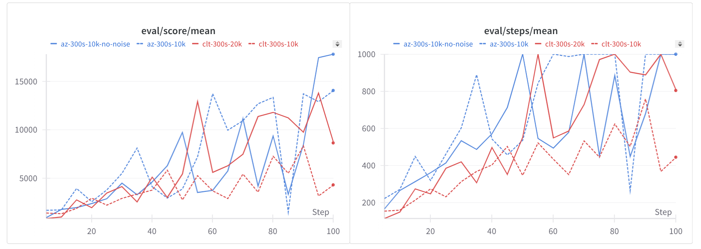

# AlphaZero Tetris

Most implementations of Reinforcement Learning applied to Tetris have been based on hand-crafted feature vectors[^1][^2] and
reduction of the action space (action-grouping)[^3], while training agents on the full observation- and action-space has failed [^4].

This project makes no such assumptions and uses the AlphaZero algorithm
to learn to play Tetris from raw observations, with the full action space, as a human player would. It is configurable 
to use any tree policy for the Monte-Carlo Tree Search, like Thompson Sampling, UCB, or other custom policies for experimentation beyond PUCT. The training 
script is designed in an on-policy & sequential way and an agent can be trained using a CPU or GPU on a single machine.

Examples of gameplay of trained agents can be found in the `./documentation` directory and in the W&B report linked below.
Additionally, one may use the custom-viewer to visualize the game state and the moves made by the agent in detail: [Rollout viewer](https://max-we.github.io/alphazero-tetris/).

<p align="center">
  
  <br>
  <em>Gameplay of a trained AlphaZero agent (PUCT policy) after 1 day of training on a single CPU</em>
</p>

- [^1] Algorta, S., & Şimşek, Ö. (2019, May 5). The game of Tetris in machine learning. arXiv.org. [https://arxiv.org/abs/1905.01652](https://arxiv.org/abs/1905.01652)
- [^2] Vietnh. (2023, April 3). GitHub - vietnh1009/Tetris-deep-Q-learning-pytorch: Deep Q-learning for playing tetris game. GitHub. [https://github.com/vietnh1009/Tetris-deep-Q-learning-pytorch](https://github.com/vietnh1009/Tetris-deep-Q-learning-pytorch)
- [^3] Michiel-Cox. (2019, October 7). GitHub - michiel-cox/Tetris-DQN: Tetris with a Deep Q Network. GitHub. [https://github.com/michiel-cox/Tetris-DQN](https://github.com/michiel-cox/Tetris-DQN)
- [^4] Liu, H., & Liu, L. (n.d.). Learn to Play Tetris with Deep Reinforcement Learning. OpenReview. [https://openreview.net/pdf?id=8TLyqLGQ7Tg](https://openreview.net/pdf?id=8TLyqLGQ7Tg)

## Training

The training logic can be found in `run/train.py`.

- On-Policy training with a buffer (size determined by `--collect_samples_per_epoch`)
- MCTS with configurable tree policy (AlphaZero or CLT-Policy or others)
  - no subtree reuse (increased comparability with other projects)
  - no transpositions / move groups (increased comparability with other projects)
  - no mcts-batch dimension (improves performance and simplicity on non-TPU hardware)

The full configuration can be found in `config.py`. The runs can be synchronized with W&B by providing an API-token.

For details on how to scale up the training to produce strong agents, please refer to the [W&B report](https://api.wandb.ai/links/go-apps-github/8vlgjurp).

## Agents

You can experiment with different agents by providing a different tree-policies, evaluation functions (e.g. neural networks), and loss functions.
This project provides a few examples, such as PUCT, UCT, a CLT-based policy, and a random policy as well as corresponding evaluation functions and loss functions.

## Results

This W&B report contains the results of training the AlphaZero and CLT-based agent: [W&B Tetris AlphaZero & CLT Policy](https://api.wandb.ai/links/go-apps-github/8vlgjurp). Note that the training could be scaled up a lot.



An example of a game played (by the CLT-policy) can be visualized with the viewer: [Rollout viewer](https://max-we.github.io/alphazero-tetris/). Replay `mp4` files are also available in the `documentation` folder.

By providing a model checkpoint and configuration, one can also generate replays using the `examine.py` script and visualize it with the viewer (also included as `viewer.html`)

## Run it yourself

You can either install the dependencies and run the training script directly with poetry or use the provided Dockerfile.

To sync a run with W&B, you need to provide an API key as an environment variable and specify a run name.

```bash
docker build -t alphazero-tetris .
# Offline run
docker run -e alphazero-tetris alphazero_tetris/run/train.py
# Online run
docker run -e WANDB_API_KEY=XXXX -e alphazero-tetris alphazero_tetris/run/train.py --wandb-run-name="TEST"
```
Configuration changes can be made in `config.py` or by providing command line arguments, e.g.

```bash
docker run -e WANDB_API_KEY=XXXX -e alphazero-tetris alphazero_tetris/run/train.py --wandb-run-name="TEST" --num-simulations=300
```

One can configure the algorithm to use (tree policy, neural network, etc.) by providing an `AlgorithmConfig` in the training script. This data
structure serves as a bundler for all the necessary components.

```python
# Initialize policy
algorithm = AlgorithmConfig(
    num_simulations=config.num_simulations,
    policy_fn=policy,
    tree_policy_fn=tree_policy_puct,
    eval_fn=eval_nn_fn,
    loss_fn=make_loss_fn(puct_loss),
    recurrent_fn = make_recurrent_fn(step_fn, eval_nn_fn, TETROMINOES, config),
)
```

## Project structure

- `alphazero_tetris/run/train.py`: Training script
- `alphazero_tetris/policies.py`: Tree policies
  - AlphaZero policy
  - Various other policies (random, greedy, etc.)
- `alphazero_tetris/mcts.py`: Monte Carlo Tree Search implementation (related to [mctx](https://github.com/google-deepmind/mctx))
- `alphazero_tetris/network.py`: Neural networks and training
- `alphazero_tetris/run/examine.py`: Benchmarking script for trained models

## Acknowledgements

I would like to thank the following projects for their inspiration and code snippets:

- [mctx](https://github.com/google-deepmind/mctx) as a reference for the MCTS implementation
- [tetris_mcts](https://github.com/hrpan/tetris_mcts) for the CLT-Policy and a working MCTS implementation for Tetris from raw observations & actions
- [tetris-gymnasium](https://github.com/Max-We/Tetris-Gymnasium) for the Tetris environment
